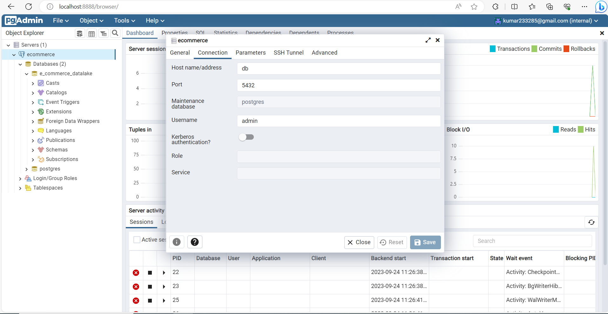
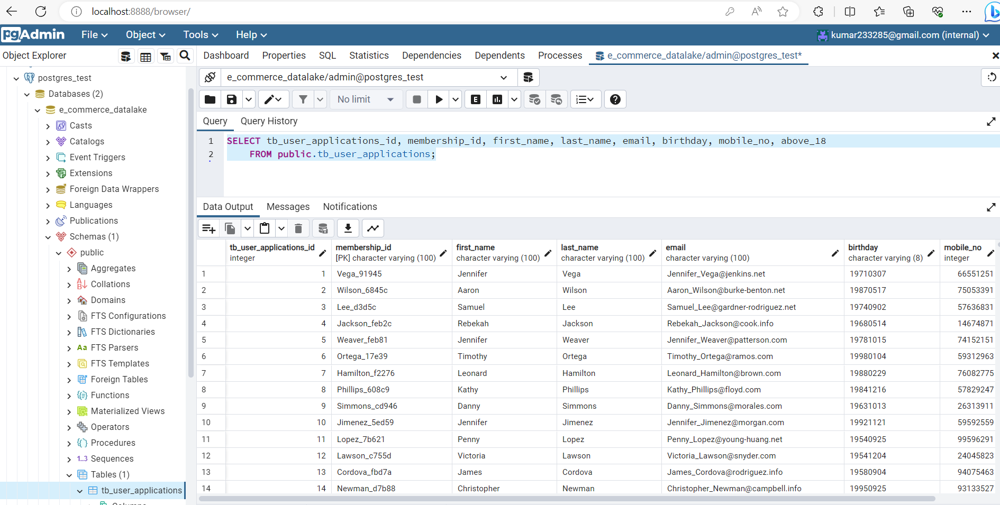
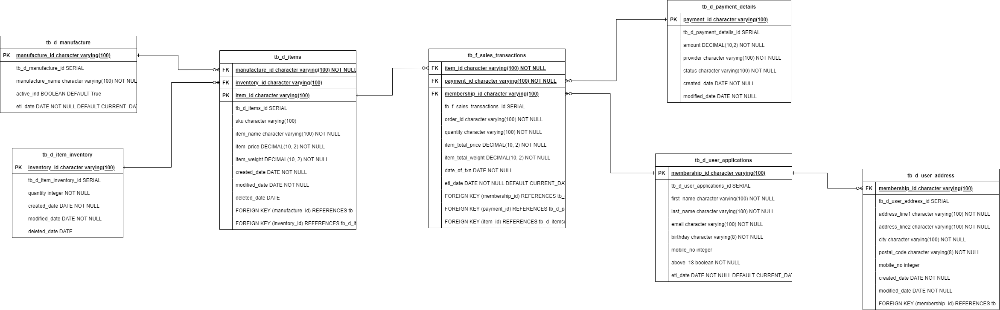

# Overview of this section
To SetUp Postgres DB with e-commerce DB setup & pgadmin using docker  

---
## Prerequistes

- Docker Desktop Installed 
---	    
             		

## Code Base Structure 
```bash
│   docker-compose.yml
│   pgadminenv
│   postgresenv
│   README.md
│
├───DB_ERD
│       Database_ERD.png
│       DB_ERD.drawio
│       DB_ERD_drawio.png
│
├───init_db_data
│   │   init.sh
│   │   init_sql_bkp
│   │
│   └───dataset
│       │   items.csv
│       │   item_inventory.csv
│       │   manufacture.csv
│       │   payment_details.csv
│       │   sales_transactions.csv
│       │
│       └───success_application
│               part-00000-bc67c6d5-b2f2-4631-ac02-91b4c689079f-c000.csv
│
├───screenshot
│       top_10_spender.PNG
│       top_3_items.PNG
│
└───sql_queries
        db_ddls.sql
        top_10_members_by_spending.sql
        top_3_items_that_are_frequently_brought_by_members.sql
```

---

## Docker Components
1. Postgres from [Postgres DockerImage](https://hub.docker.com/_/postgres)
2. PgAdmin from [Pgadmin DockerImage](https://hub.docker.com/r/dpage/pgadmin4)

### Docker Compose
1. run 'docker-compose up -d'
2. It will run the containers and create db tables and load data as well.
3. There is a folder init_db_data which is mapped to volume of postgre container 'docker-entrypoint-initdb.d' 
4. Inside postgres container will be executed init.sh ( Shell script ) which has all the DDLs.
5. Inside init_db_data all the sample data has been placed in CSV Format , which will be loaded into the respective tables during init.sh execution itself.
6. Upon Successful completion you should be able to see both containers running in docker desktop.
7. pgadmin is mapped to port 8888, so we can navigate to [pgadmin](http://localhost:8888/) to login .

8. Sample Data check 

---

### Execute SQL Queries for below KPI using the query provided in sql queries.
1. Which are the top 10 members by spending
2. Which are the top 3 items that are frequently brought by members
---

## Database ERD


---
##  DATABASE DESIGN
1. The Tables are categorised as facts and dimensions.
2. And the schema followed is 3NF Form ( 3rd Normalistion Form)

Following are the List of tables created ( Naming convention followed to distinguish facts and dimensions )
1. tb_d_user_applications
2. tb_d_user_address
3. tb_d_manufacture
4. tb_d_item_inventory
5. tb_d_payment_details
6. tb_f_sales_transactions

### Performance and Tuning Tips
1. As of now Only Primary Keys and Foriegn keys are created on tables.
2. But in Real world , We can create INDEXES on columns which are in demand.
3. The Facts ( Sales Transaction ) table can be stored in partition wise to meet the performance, availability, and manageability.
