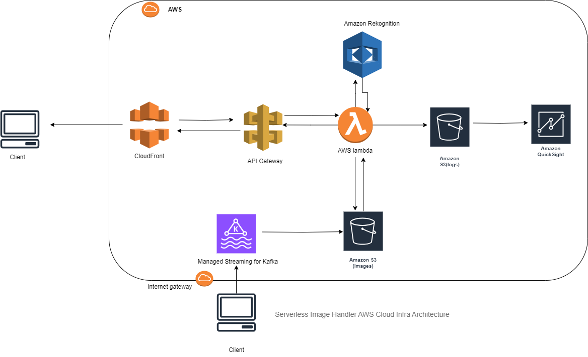

# Overview of this section
To design data infrastructure on the cloud for a company whose main business is in processing images.  

---

This solution creates a serverless architecture to initiate cost-effective image processing in the AWS Cloud. The architecture combines AWS services with sharp open-source image processing software and is optimized for dynamic image manipulation. You can use this solution to help you maintain high-quality images on your websites and mobile applications to drive user engagement.

Source: https://aws.amazon.com/solutions/implementations/serverless-image-handler/

---
The diagram below presents the serverless architecture you can deploy in minutes using the solution’s implementation guide and accompanying AWS CloudFormation template.

---
## AWS services used:
- Amazon CloudFront — Core. Provides a caching layer to reduce latency and the cost of image processing for subsequent identical requests.

- AWS Lambda — Core. Runs functions to retrieve, modify, and invoke other services to analyze images. Also runs a function to support URL signature validation.

- Amazon S3 — Core. Stores images, logs, and a demo UI. 

- AWS Identity and Access Management (IAM) — Supporting. Allows for fine-grained access permissions.

- AWS CloudFormation — Supporting. Deploys the solution’s underlying AWS resources.

- AWS CDK — Supporting. Provides infrastructure as code constructs to generate the solution’s underlying CloudFormation templates.

- Amazon API Gateway — Supporting. Provides API endpoints to invoke Lambda functions.

- Amazon Rekognition — Optional. Uses machine learning (ML) to analyze images.

- Amazon Managed Streaming for Kafka - Amazon MSK makes it easy to ingest and process streaming data in real time with fully managed Apache Kafka. 

- Amazon Quick Insight - Amazon QuickSight is a fast, cloud-powered business intelligence service that delivers insights to everyone in your organization. As a fully managed service, Amazon QuickSight lets you easily create and publish interactive dashboards that include machine learning (ML) insights. 

This solution uses AWS services that aren’t available in all AWS Regions. You must launch this solution in an AWS Region where these services are available.

---
### Walkthrough

- Step 1 : The AWS CloudFormation template deploys an Amazon CloudFront distribution that provides a caching layer to reduce the cost of image processing and the latency of subsequent image delivery. The CloudFront domain name provides cached access to the image handler API.

- Step 2 : Amazon API Gateway to provide endpoint resources and initiate the AWS Lambda function.

- Step 3 : A Lambda function that retrieves the image from a customer’s existing Amazon S3 bucket and uses Sharp to return a modified version of the image to the API Gateway.

- Step 4 : An Amazon S3 bucket for log storage, separate from your customer-created S3 bucket for storing images. If selected, the solution deploys an S3 bucket for storing the optional demo UI.

- Step 5 : If you activate the image URL signature feature, the Lambda function retrieves the secret value from your existing AWS Secrets Manager secret to validate the signature.

- Step 6 : If you use the smart crop or content moderation features, the AWS Lambda function calls Amazon Rekognition to analyze your image and returns the results.

- Step 7: Amazon QuickSight Feeds on s3 data to gather Insights with unified business intelligence (BI) at hyperscale. With QuickSight, all users can meet varying analytic needs from the same source of truth through modern interactive dashboards, paginated reports, embedded analytics, and natural language queries.

- Step 8 : Amazon MSK makes it easy to ingest and process streaming data in real time with fully managed Apache Kafka.

---
### Key Pointers
- Managability
- Scalability
- Highly Secure
- High Availability
- Elastic
- Fault Tolerant and Disaster Recovery
- Efficient
- Low Latency
- Least Privilege

---
## Concerns

### Image Archiving 
- S3 bucket set policy to retain images for 7 days then delete 

### Securing access to the environment and its resources as the company expandsy
- s3 Data at rest encrypted using cloud provider's encryption services to ensure security.
- In AWS data is always secure whether in transit or at rest 

### Securing access to the environment and its resources as the company expands
- AWS is secure using internet gateway , VPC and subnets even if company goes global

### Scaling to meet user demand while keeping costs low
- AWS Pricing models are only on pay as per use .

### Maintainance of the environment and assets (including processing scripts)
- AWS Infra set up using cloud formation service 
- AWS assest management using CodeCommit, COdebuild, CodePipeline etc.

### Other concerns
- All AWS Services mostly used for computation are serverless , which leverage the concerns like Managability, High Availability, Scalability, Efficient, low latency etc..
- AWS has IAM Services which take cares of concern like least Privilege using policy features.

